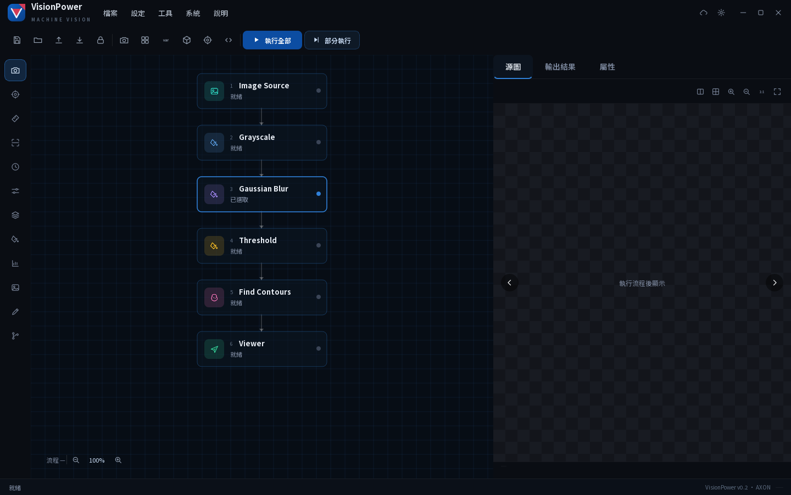

# VisionPower

A factory-floor **image-processing & defect-detection platform** with a
node-based, low-code workflow editor. Build inspection pipelines by wiring
**nodes** on a blueprint canvas (OpenCV today, CPU models next), tune parameters
with live preview, and save/load workflows as JSON.

The desktop UI follows the **AXON** design language: a frameless dark window in
the AGC corporate palette (deep blue `#0C4DA2` · cyan accent `#2F80D8` · red
`#D23A55`), a self-drawn blueprint node canvas, and a custom title bar / toolbar
/ left icon dock / right inspection panel — all built directly in PySide6 with
**no NodeGraphQt dependency**.



## Architecture

The guiding principle is **engine/UI decoupling**: the workflow engine is pure
Python with **zero Qt dependency**, so it can run headless (batch / factory
service) and be fully unit-tested. The UI, a future headless service, and a
future LLM/agent layer are all just consumers of the same engine.

```
 app (PySide6 UI — frameless shell + self-drawn canvas)
 ─────────────────────────────────────────────────────────────────────────
 nodes   (OpenCV / model / IO node implementations)
 ─────────────────────────────────────────────────────────────────────────
 core    (pure Python, no Qt)
   types · ports · params · node · registry · graph · scheduler · serialize · inference
```

Key ideas:
- **Self-describing nodes.** Each node declares typed ports + `ParamSpec`s. That
  one schema powers the node cards, the auto-generated property panel,
  connection type-validation, and the future LLM layer (`core.node_schema()`).
- **Incremental cache.** The scheduler signs each node by its params + upstream
  signatures; tweaking one parameter recomputes only that node and its
  descendants — the rest hit the cache (live tuning).
- **Per-node error isolation.** A failing node is reported, not fatal; downstream
  nodes are skipped.
- **Pure-data UI bridge.** `GraphBridge` holds an ordered list of core nodes and
  rebuilds a runnable `core.Graph` on demand — no UI framework leaks into the
  engine, and the canvas is just one possible renderer of that data.

### Layout
- [visionpower/core/](visionpower/core/) — engine (Qt-free)
- [visionpower/nodes/](visionpower/nodes/) — built-in OpenCV nodes
- [visionpower/render.py](visionpower/render.py) — overlay/display helpers (OpenCV, no Qt)
- [visionpower/app/](visionpower/app/) — PySide6 desktop UI
  - `theme` · `constants` · `icons` — AGC palette, dimensions, line-icon factory (QtSvg)
  - `title_bar` · `toolbar` · `dock` — frameless chrome + left category dock
  - `canvas` — self-drawn blueprint node canvas (QPainter)
  - `panels` · `preview_view` · `property_panel` — right 源圖 / 輸出結果 / 屬性 tabs
  - `graph_bridge` · `demo_flow` — pure-Python bridge to the engine
  - `main_window` — assembles the shell and wires it to the real engine
- [tests/](tests/) — engine tests + headless (offscreen) UI tests

## Setup & run

```bash
uv sync                       # core engine + tests (no Qt)
uv sync --extra gui           # add the desktop UI stack (PySide6 + QtSvg)
uv run python main.py         # launch the app  (or: uv run visionpower)
```

The window opens with a sample pipeline already on the canvas:
`ImageSource → Grayscale → GaussianBlur → Threshold → FindContours → Viewer`.

- **執行全部** runs the whole flow; nodes light up in sequence and the source
  image scans while running.
- **部分執行** runs from the selected node downward.
- Click any node to edit its real parameters (**屬性** tab) and see its image
  output (**源圖**) or structured result (**輸出結果**) on the right.
- Parameter edits re-run incrementally (only changed nodes recompute).
- The floating control bar (bottom-left of the canvas) shows run-time and zoom.
- **儲存 / 載入** persist the workflow to JSON.

Window controls: the custom title bar provides minimise / maximise / close;
drag the title bar to move, and resize from the bottom-right grip.

## Test

```bash
uv run pytest                                          # engine tests (no Qt)
uv sync --extra gui --group gui-dev
QT_QPA_PLATFORM=offscreen uv run pytest                # + headless UI tests
```

## Roadmap
- **M1 (done)** — engine + OpenCV nodes + node editor + preview + save/load.
- **M1.5 (done)** — VisionMaster-style UI: ImageSource folder node + batch run.
- **AXON UI (done)** — frameless redesign: AGC palette + self-drawn blueprint
  canvas, NodeGraphQt removed, engine wiring preserved.
- **M2** — model nodes via an `InferenceBackend` (OpenVINO on Intel CPU; ONNX fallback).
- **M3** — NAS/folder sources + watch queue + parallel batch + result export.
- **M4** — headless service for unattended factory deployment.
- **M5** — LLM/agent assistance for workflow design & parameter suggestion.

Project-specific Claude Code skills live in [.claude/skills/](.claude/skills/):
`scaffold-node`, `run-app`, `gui-verify`. Changes are tracked with OpenSpec
(see [openspec/](openspec/)).
